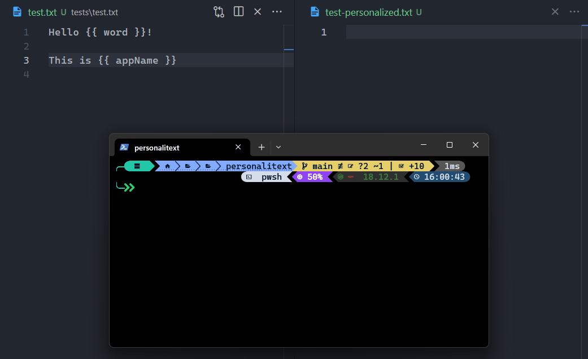

# ✒️ PERSONALITEXT

> Create multiple texts from a single template

Useful for creating multiple texts with the same structure, but different content.

👁️ Use case: write an email template and create multiple emails from it for different recipients.



## Installation

You can install personalitext globally with npm:

```bash
npm install -g personalitext
```

Or you can use it with npx:

```bash
npx personalitext <path to template file>
```

## Usage

```bash
personalitext <path to template file>
```

## License

[MIT](./LICENSE) © [David Jiménez](https://dubis.dev)
